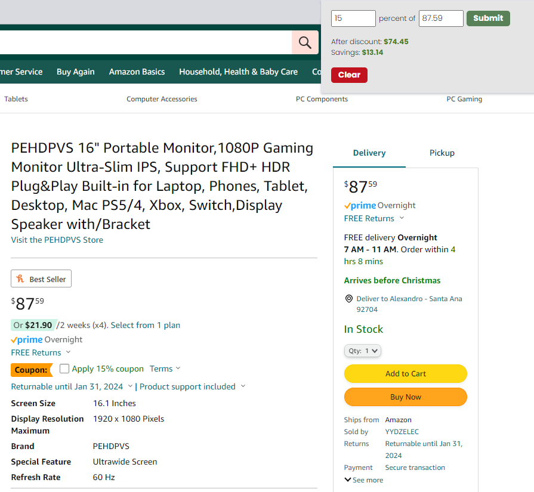

# discount-calculator
 Chrome extension for a discount calculator

## Installation
1. Download ZIP
2. Extract ZIP
3. On chrome ⋮ > Extensions > Manage Extension
4. Turn on developer mode (located top right corner)
5. Load unpacked (located top left corner)
6. Open "discount-calculator" extracted folder
7. click on Extensions > discount calculator
- (Optional) pin the extension for quick access

## Usage

## Contributing
For security reasons no changes are allowed on this repo from external developers.
Feel free to fork and update the extension as you please.

## License
[MIT](https://choosealicense.com/licenses/mit/)